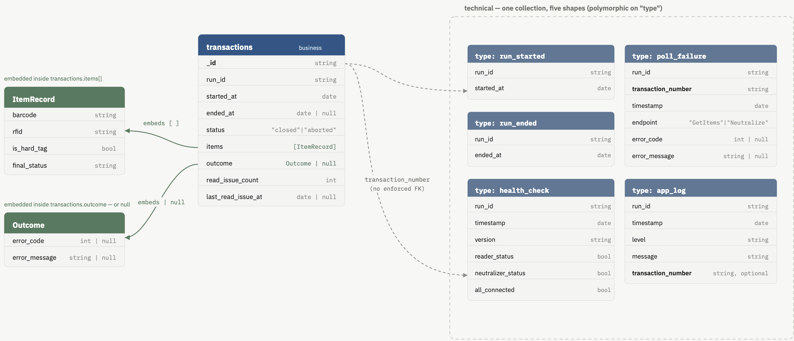

# Planning Notes: PayTag Fast-Checkout Client

The written plan required by the assignment brief, covering the six points it asks for.

## 1. Which endpoints we'll call, and when

**`GET /info`** - called once at startup, before the hotkey listener starts, as a pre-flight check. Fails fast if the machine isn't reachable.

*Why:* also considered re-checking `/info` at the start of every session, but dropped it - the first `GetItems` poll after `S` already surfaces a disconnected reader/neutralizer through the same mid-poll handling below, at most one poll interval later, so a separate recheck would just duplicate that.

**`POST /partner/GetItems`** - triggered by `S`, then **polled every ~1.5s** (YAML-configurable) for as long as the session is open, rather than read once.

*Why:* the documented flow has the operator loading items *after* `S` is pressed. A single read at that moment would see an empty basket and never update - directly contradicting "surface what is in the basket while the session is open." Polling is the only approach that satisfies this.

Two things fell out of that:

- **Poll interval** - balanced responsiveness against redundant load; ~1.5s felt right, made configurable rather than hardcoded.
- **Concurrency at `N`** - the machine is a single shared resource, so pressing `N` immediately stops scheduling new polls, but lets an in-flight poll finish before `Neutralize` is sent. (Considered whether a separate payment-confirmation step would change this - it wouldn't; the rule is about never overlapping two live calls, independent of what comes next.)
- **Mid-poll failures** - non-fatal: keep the last basket on screen (marked stale), keep retrying, but never auto-abort - that's the operator's call. The warning prints once when the outage starts and once on recovery, not on every failed poll in between - no escalation for a prolonged outage, since the API gives no signal to escalate on (every error code describes *what's* wrong, never *how long* it's been wrong), and a single unresolved warning already tells the operator something is broken for as long as it stays broken.

**`POST /partner/Neutralize`** - triggered by `N`, built from the last known basket (`Barcode`+`RFID`). Items flagged `IsHardTag: true` are excluded from the request and tracked separately.

*Why:* the `Neutralize` contract is inherently electronic - a hard tag can't undergo it. Sending them anyway and relying on the response to tell them apart would conflate two different kinds of outcome.

## 2. Where the hotkey logic lives

Stack: **Python**, matching PayTag's own backend (Python, MongoDB, GCP) rather than an unrelated choice.

**Global key capture: `pynput`.** Python has no built-in way to capture keypresses system-wide, so I compared the two common libraries. `keyboard`'s own docs call its macOS support experimental (it's built primarily for Windows/Linux); `pynput` is properly cross-platform with a dedicated macOS backend. Both need the same one-time Accessibility permission on macOS, so `pynput`'s maturity on the OS I'm shipping on was the deciding factor.

**Concurrency: plain `threading`, not `asyncio`.** `pynput`'s listener already runs its own thread. Considered `asyncio` since it's the modern default for I/O-bound Python, but every part of this app is single-operation-at-a-time by design - one poll in flight, one `Neutralize` call, a handful of Mongo writes, one session at a time. That's exactly the case where `asyncio` adds complexity without benefit: the listener stays on its own thread, and the polling loop runs on a plain thread coordinated by a `threading.Event` stop signal. (Consistently, MongoDB writes use plain `pymongo`, not the async `motor` driver.)

**Where the session logic actually lives.** `pynput` only reports raw key events - it has no concept of "sessions." A thin callback we write checks the pressed key against the YAML-configured hotkeys and calls a method on `SessionManager`, a plain class we design ourselves, which owns the polling thread, the stop-`Event`, the API calls, and persistence. This keeps the listener ignorant of checkout logic, which is what makes `SessionManager` testable without simulating real keypresses. The **session-already-open guard** (ignore a second `S`; ignore `N` with nothing open) lives inside `SessionManager`, not the listener, since it's a business-logic concern.

**Smaller details:** react on `on_press` only; match the hotkey case-insensitively; key auto-repeat needs no extra handling (the session-guard already absorbs duplicate presses). One limitation worth stating plainly: since `S`/`N` are unmodified global keys, typing them as part of ordinary text elsewhere (e.g. "sale") would falsely trigger a session on a shared dev keyboard. Not something the code tries to solve - the brief's framing implies these keystrokes come from a dedicated hardware trigger in production, not a keyboard used for typing.

## 3. MongoDB collection design

Two collections: `transactions` (business) and `technical` (technical, polymorphic via a `type` field).

```
transactions:
{
  _id: transaction_number,   // e.g. "P260828143005123" - the transaction number doubles as the document's own key
  run_id,
  started_at, ended_at,
  status: "closed" | "aborted",
  items: [ { barcode, rfid, is_hard_tag, final_status: "neutralized"|"failed"|"hard_tag_pending_removal" } ],
  outcome: { error_code, error_message } | null,
  read_issue_count, last_read_issue_at
}

technical:
{ type: "run_started",  run_id, started_at }
{ type: "run_ended",    run_id, ended_at }
{ type: "health_check", run_id, timestamp, version, reader_status, neutralizer_status, all_connected }
{ type: "poll_failure", run_id, transaction_number, timestamp, endpoint, error_code, error_message }
{ type: "app_log",      run_id, timestamp, level, message, transaction_number? }
```



**Core decisions:**

- **Embed items + outcome in `transactions`; reference everything else via `run_id`.** Items/outcome are small, bounded, always used with their transaction - the classical embed case. `Run`, `poll_failure`, `app_log` are unbounded over a run's lifetime, so they're referenced instead, avoiding MongoDB's 16MB document limit.
- **Neutralization outcome is a field, not its own collection** - 1-to-1 with a transaction, created at the same moment; a separate collection would just add a join for no benefit.
- **`outcome` is nullable - but only for an aborted session** (`Ctrl+C` mid-session). `Neutralize` is called even when the basket is empty (confirmed live: an empty-`Items` request returns a clean `ErrorCode: 0`), so a normally *closed* session always gets a real outcome - never null, even if nothing was ever scanned.
- **Poll issues surface on the business side as two bounded scalars** (`read_issue_count`, `last_read_issue_at`), not an embedded array - signals an issue without duplicating technical detail or risking unbounded growth.
- **Transaction number is timestamp-based, not a UUID** - sortable, more compact than a UUID, and (now) millisecond-precision to make a collision practically impossible. It's stored as the document's own `_id` rather than a separate field - already unique and immutable, so it gets uniqueness enforcement for free, with no extra index to create or maintain.
- **Clean shutdown on `Ctrl+C`** marks any open transaction `aborted` and writes `run_ended`; a hard kill is accepted as an orphaned `run_started` - meaningful on its own, not engineered around.

## 4. How each error path will be covered

Every call is checked on **three separate channels**, not just the JSON body: connection-level (no response), HTTP-level (status ≠ 200), and application-level (the `ErrorCode` field).

| Channel    | Code                | Name                               | Meaning                                                                                                                                                                                                                           | How it's handled                                                                                                                                                                                               |
| ---------- | ------------------- | ---------------------------------- | --------------------------------------------------------------------------------------------------------------------------------------------------------------------------------------------------------------------------------- | -------------------------------------------------------------------------------------------------------------------------------------------------------------------------------------------------------------- |
| Connection | -                   | *(no response)*                  | Simulator unreachable, timeout, network error                                                                                                                                                                                     | `/info` at startup → fail fast, no retry. `GetItems` mid-poll → transient, keep polling. `Neutralize` → 1 retry (full resend), then `outcome.error_code: null` ("unconfirmed") if still unresolved. |
| HTTP       | `400`             | Bad Request                        | Our own request was malformed (e.g. missing`TransactionNumber`)                                                                                                                                                                 | Never retried - logged as`app_log(error)` as a bug, not an operational failure.                                                                                                                              |
| App        | `0`               | None                               | Success                                                                                                                                                                                                                           | Determined only by`ErrorCode` - never `ErrorMessage` (see "Core decisions" below).                                                                                                                         |
| App        | `1`               | GeneralError                       | Unspecified error                                                                                                                                                                                                                 | `Neutralize`: 1 retry (full resend, since it doesn't tell us which items were touched).                                                                                                                      |
| App        | `4`               | ReaderNotConnected                 | RFID reader disconnected                                                                                                                                                                                                          | `GetItems`: transient, keep polling. `Neutralize`: 1 retry, full resend - safe, since both response arrays come back empty (nothing was touched).                                                          |
| App        | `8`               | NeutralizerNotConnected            | Neutralizer disconnected                                                                                                                                                                                                          | Same handling as`4`.                                                                                                                                                                                         |
| App        | `17`              | NotAllTagsNeutralized              | Some items failed, some succeeded                                                                                                                                                                                                 | `Neutralize`: 1 retry, **scoped to only the failed items** - succeeded items keep their status and are never resent.                                                                                   |
| App        | `2,3,5,6,7,9–16` | *(various hardware-fault codes)* | Listed in the Postman collection's description but never demonstrated; attempted to confirm via the compiled simulator - inconclusive, since the build is deliberately obfuscated (`javascript-obfuscator` in `package.json`) | Handled generically via a full code→name lookup table - never silently dropped as "unknown."                                                                                                                  |

**Core decisions:**

- **Three channels, always** - a single "parse the JSON body" approach would miss the `400` case the Postman collection itself demonstrates.
- **`ErrorCode` is the only source of truth for success/failure** - never `ErrorMessage`'s nullness, a deliberate trap in the API's own examples.
- **`Neutralize` never assumes success on a communication failure.** It's a one-shot, side-effecting call with no idempotency guarantee - "unconfirmed, check manually" is safer than a false "success" on a security-tag system.
- **Retry scope depends on what's actually known** - full resend whenever it's unclear what was touched (see table); a scoped resend of just the failed subset only for `17`, the one case with enough information to avoid re-touching successes.
- **Unverifiable codes are handled defensively, not ignored** - the obfuscated build blocked confirming whether the simulator emits the other 12, so the design assumes it might.

## 5. What the terminal output will look like

Every line is timestamped (`HH:MM:SS`) so the operator can always tell exactly when something happened.

```
[14:30:00] PayTag Fast-Checkout Client
[14:30:00] Config loaded from config.yaml
[14:30:00] Checking machine at localhost:8765 ... OK (v3.8.34, reader: connected, neutralizer: connected)
[14:30:00] Ready. Press S to start a checkout session, Ctrl+C to exit.

[14:30:05] Session P260828143005123 started - scanning...
[14:30:06]   + Item added: barcode 7290000000001 (RFID E200001B...0001)
[14:30:08]   + Item added: barcode 7290000000002 (RFID E200001B...0002) - HARD TAG
[14:30:08] Basket now has 2 items (1 hard tag)

[14:30:12] ⚠ Could not read the scanner (reader not connected) - showing basket as of 14:30:08, retrying...
[14:30:14] ✓ Scanner back online - basket confirmed, no changes

[14:30:25] Closing session - finalizing basket: 2 items (1 hard tag excluded from neutralization)
[14:30:25] Neutralizing 1 item...

================== CHECKOUT RESULT - P260828143005123 ==================
 Closed at 14:30:26 (session lasted 21s)

 ✓ Neutralized:                1 item
 ✗ Failed:                     0 items
 ⚠ HARD TAG - REMOVE MANUALLY: 1 item (barcode 7290000000002)
===========================================================================

[14:30:26] Ready. Press S to start a checkout session, Ctrl+C to exit.

^C
[14:35:02] Shutting down - no active session.
[14:35:02] Goodbye.
```

If `Neutralize` can't be confirmed (a communication failure - point 4), the outcome block is deliberately different so it can't be skimmed past:

```
============================= ACTION REQUIRED =============================
 14:30:26 - Could not confirm neutralization (connection lost during the request)
 DO NOT assume items are neutralized. Check the gate/machine manually.
=============================================================================
```

And if `Ctrl+C` happens mid-session instead of at idle: `[14:35:02] Shutting down — session P260828143005123 marked as aborted`.

**Core decisions:**

- Only print on basket change, not on every poll tick - avoids flooding the screen with an identical basket every ~1.5s.
- A poll failure is explicitly closed out on recovery ("back online"), not left to resolve silently.
- Plain-text symbols (`✓ ✗ ⚠`), not ANSI color - renders reliably everywhere without a dependency.
- The stale-basket warning always names the last-confirmed time, so the operator can judge how much to trust what's on screen.
- The unconfirmed-neutralization outcome gets a visually distinct block - matches the seriousness of never assuming success on a communication failure (point 4).

## 6. Alternatives considered

Most alternatives are documented inline at the point where the decision was made - indexed here rather than restated:

- Single-snapshot `GetItems` vs. continuous polling - point 1
- Including hard-tag items in the `Neutralize` request vs. excluding them - point 1
- Per-session `/info` recheck vs. relying on poll-failure handling - point 1
- `pynput` vs. `keyboard` - point 2
- `asyncio` vs. plain `threading` - point 2
- Embedding vs. referencing scanned items and the neutralization outcome - point 3
- UUID vs. timestamp-based transaction numbers - point 3
- Blanket retry vs. failure-scoped retry for `Neutralize` - point 4

Two more, not captured elsewhere:

1. **Language: matching the simulator (Node.js) vs. the company's stack (Python).** REST/HTTP+JSON is language-agnostic by design - a client never needs to share a language with its server. The simulator is also a disposable, obfuscated test harness, not representative of PayTag's real backend - aligning with the company's actual stack (Python, MongoDB, GCP) is the more relevant signal, so Python was chosen.
2. **Additional MongoDB collections considered and rejected:**

   - *Config snapshot per run* - belongs as a field on `run_started`, not its own collection.
   - *Machine/device registry* - only relevant with more than one physical machine; out of scope here.
   - *Rollup/aggregated stats collection* - premature; MongoDB's aggregation framework already answers this against `transactions`.
   - *Fine-grained per-session event timeline* - would reintroduce the noisy per-poll-tick logging rejected in point 1.
   - *Dedicated hard-tag collection* - answerable via aggregation + an index on `items.final_status`.
